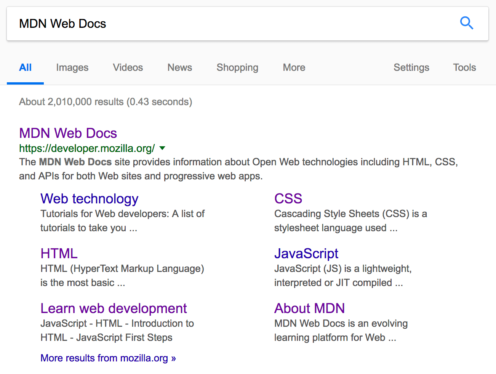

[Centering the elements](https://www.freecodecamp.org/news/how-to-center-anything-with-css-align-a-div-text-and-more/)

[Accesibility info](https://medium.com/@zmactavish/15-html-tags-for-accessibility-2738183cbc3)

Note: Accessing the innerHTML of elements from JavaScript will keep all the whitespace intact. This may return unexpected results if the whitespace is trimmed by the browser.

| Literal Character | Character Reference Equivalent |
|------------------|--------------------------------|
| `<`              | `&lt;`                          |
| `>`              | `&gt;`                          |
| `"`              | `&quot;`                         |
| `'`              | `&apos;`                         |
| `&`              | `&amp;`                          |

Specifying a description that includes keywords relating to the content of your page is useful as it has the potential to make your page appear higher in relevant searches performed in search engines. Example:

The &lt;script&gt; element should also go into the head, and should include a src attribute containing the path to the JavaScript you want to load, and defer, which basically instructs the browser to load the JavaScript after the page has finished parsing the HTML. This is useful as it makes sure that the HTML is all loaded before the JavaScript runs, so that you don't get errors resulting from JavaScript trying to access an HTML element that doesn't exist on the page yet. There are actually a number of ways to handle loading JavaScript on your page, but this is the most reliable one to use for modern browsers

Here's the best rule you can remember: It's only appropriate to use &lt;b&gt;, &lt;i&gt;, &lt;u&gt;to convey a meaning traditionally conveyed with bold, italics, or underline when there isn't a more suitable element; and there usually is. Consider whether &lt;strong&gt;, &lt;em&gt;, &lt;mark&gt; might be more appropriate.

todo
-grid layout 
-js